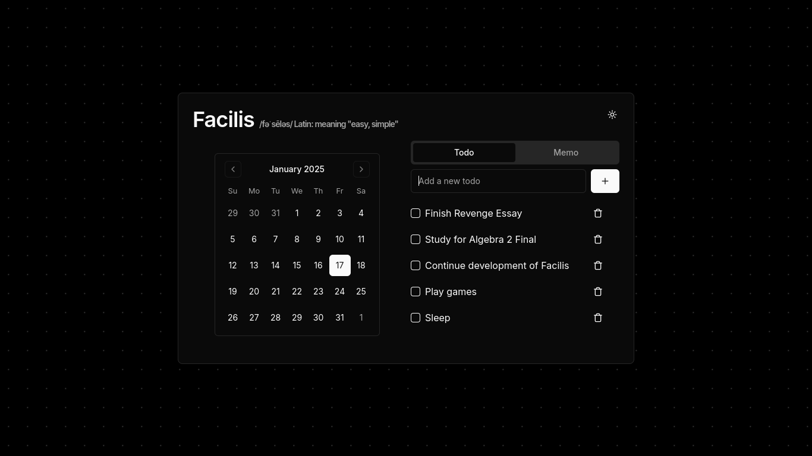

#  Facilis

**Facilis**: Easy Task and Memo Management  
A sleek and intuitive calendar-based To-Do List and Memo application built with **Next.js**. With its pleasing aesthetics and seamless functionality, Facilis helps you manage tasks and memos efficiently, ensuring you stay organized and productive.

---

## 🌟 Features

- 🗓 **Calendar Integration**: Effortlessly manage your daily, weekly, or monthly tasks with a clean and user-friendly calendar view.
- 📝 **Memo Functionality**: Jot down quick notes or detailed memos and access them anytime.
- 💾 **Local Storage**: All your tasks and memos are securely stored locally, ensuring your data is private and always available.  
- 🎨 **Beautiful Design**: Aesthetically pleasing interface to make task management enjoyable.
- 📱 **Responsive Design**: Fully optimized for desktop, tablet, and mobile use.
- 🌓 **Light & Dark Themes**: Personalize the look and feel of the app.
- ⚡ **Fast and Secure**: Built on Next.js for fast performance and reliability.


## Preview

  
*(screenshot of my daily usage of Facilis!! :skull:)*


## Getting Started

### Prerequisites

- **Node.js** (v16 or later)
- **npm** or **yarn**

### Installation

1. Clone the repository:
   ```bash
   git clone https://github.com/T3M1N4L/facilis.git
   ```
2. Navigate to the project directory:
   ```bash
   cd facilis
   ```
3. Install dependencies along with next:
   ```bash
   npm i
   npm i next -g
   ```
4. Build and start using next:
    ```bash
    next build
    next start
    ```
5. It shoudl open at https://localhost:3000, if it doesn't you did something wrong :shrug:


## 🛠️ Built With

- [Next.js](https://nextjs.org/) - React Framework
- [LocalStorage API](https://developer.mozilla.org/en-US/docs/Web/API/Window/localStorage) - Client-side data storage

## 🤝 Contributing

Contributions are welcome! Please fork this repository, create a new branch, and submit a pull request. Ensure your code adheres to the project's coding standards.


**Facilis** - *Simplifying task and memo management.*
